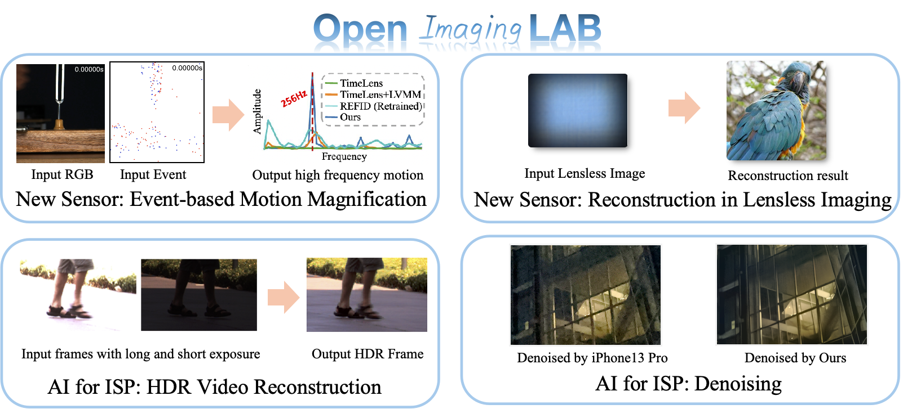

    

## Welcome to OpenImagingLab! 👋

The OpenImagingLab is a research group from Shanghai AI Lab. We are dedicated to utilizing advanced AI algorithms to research and design innovative AI vision sensors, image processing pipeline, optical components, camera systems and brain-inspired computing hardware for AI-ISP. Leveraging deep learning and generative AI, the team aims to develop next-generation systems suitable for image capture and 3D imaging.

    

  

**We are looking for self-motivated Interns and Joint Training PhD Students ([Details](https://www.shlab.org.cn/enrollment#channel_599)), who are interested in computational photography, computer vision and computer graphics. Email:openimaginglab@pjlab.org.cn**
